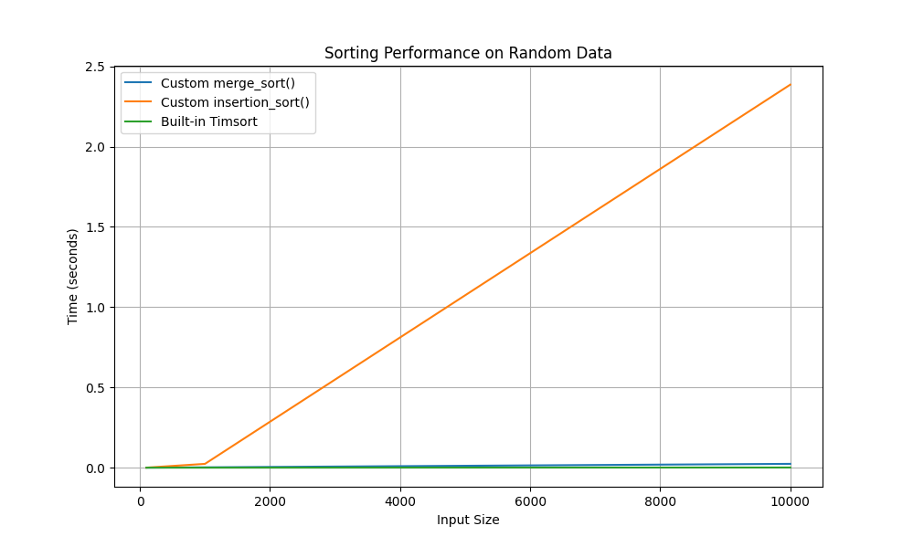
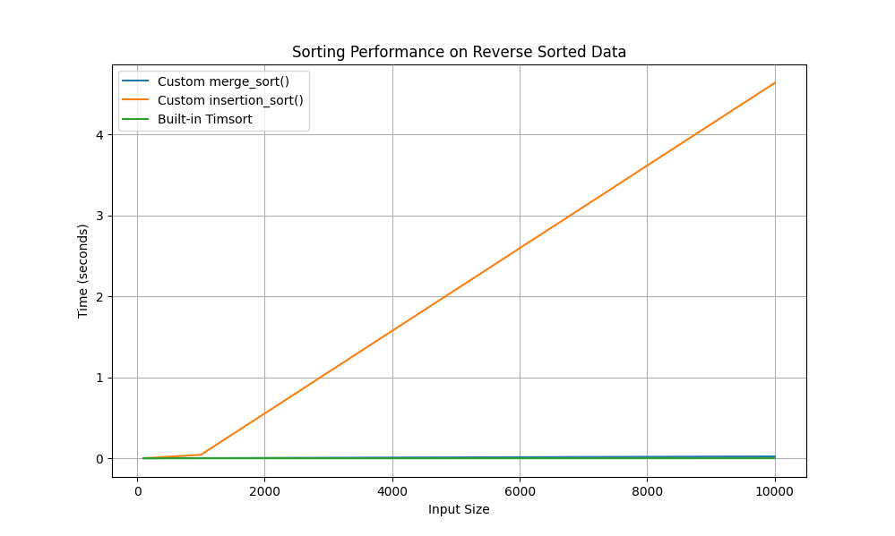
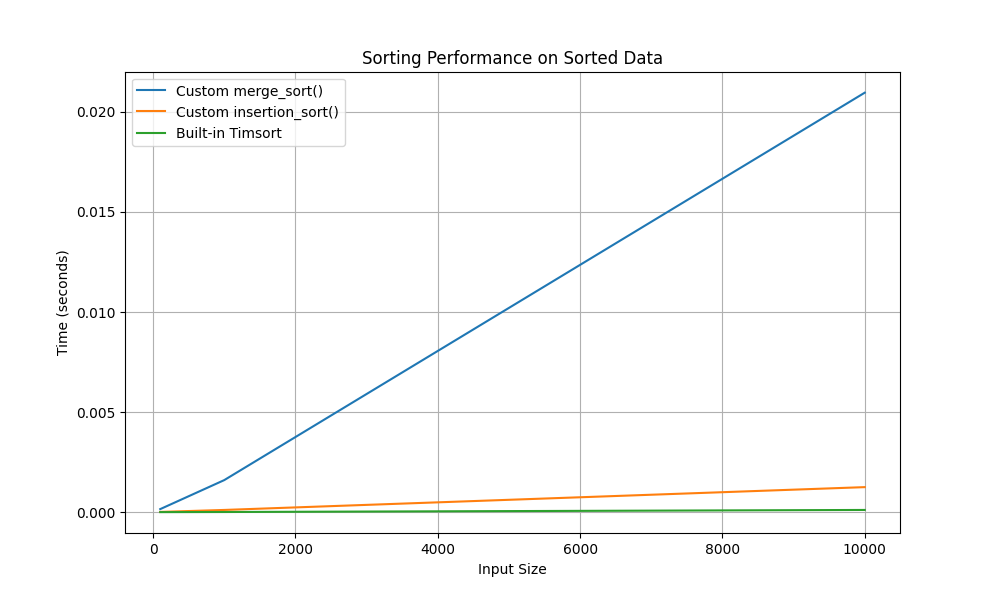

# Comparison of sorting algorithms: custom merge_sort and insetrion_sort, and built-in sort (algorithm Timsort).

### Envirement setup

```
python -m venv .

source bin/activate

pip install -r requirements.txt
```

### Running scripts

```
python experiment.py

```
### Comparison of Sorting Algorithms:

```
  Size  Type              custom_merge_sort() (s)    custom_insertion_sort() (s)    Built-in Timsort (s)
------  --------------  -------------------------  -----------------------------  ----------------------
   100  Random                           0.000177                       0.000209                0.000007
   100  Sorted                           0.000152                       0.000012                0.000002
   100  Reverse Sorted                   0.000155                       0.000411                0.000005
  1000  Random                           0.002079                       0.023654                0.000074
  1000  Sorted                           0.001600                       0.000110                0.000008
  1000  Reverse Sorted                   0.001577                       0.043036                0.000034
 10000  Random                           0.023782                       2.386423                0.001001
 10000  Sorted                           0.020943                       0.001249                0.000110
 10000  Reverse Sorted                   0.022786                       4.633822                0.000314
```

### Sorting Performance on Random Data


### Sorting Performance on Reverse Sorted Data


### Sorting Performance on Sorted Data
